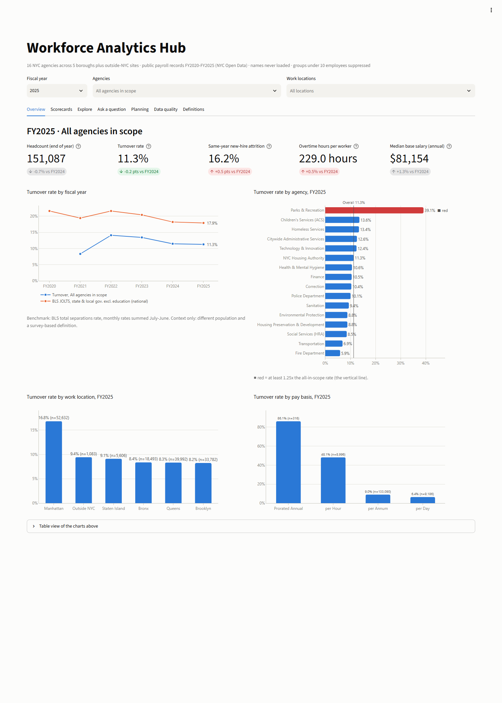

# Workforce Analytics Hub

A governed, self-service workforce analytics product built on **real public payroll records**:
1,119,873 records for 16 New York City agencies, FY2020–FY2025, from NYC Open Data. It turns
raw payroll extracts into governed metrics (turnover, new-hire attrition, headcount, tenure,
overtime), multi-location scorecards, an automated Excel + PowerPoint report pack, and a
plain-English question box that only answers from computed data.

It is a solo portfolio project. It has no users, and nothing here claims business impact.

**Live demo: https://workforce-analytics-app.streamlit.app/**. It runs on the committed
24,000-row sample (250 real records per agency per year), labelled on every page, so its numbers
differ from the full-data results below. If the app has been idle, Streamlit may ask you to wake it
up first.



More screenshots (from the full data):
[scorecard](docs/screenshots/scorecard.png) ·
[Q&A answer](docs/screenshots/ask_answer.png) ·
[Q&A refusal](docs/screenshots/ask_refusal.png) ·
[data quality](docs/screenshots/data_quality.png).
Generated report pack: [Excel](docs/sample_output/workforce_scorecard_FY2025.xlsx) ·
[PowerPoint](docs/sample_output/workforce_scorecard_FY2025.pptx).

## What it demonstrates

| Capability | Where it lives |
|---|---|
| Automated, reproducible pipeline: API ingest → data-quality checks → SQL warehouse | `wfa fetch`, `wfa build` (`src/wfa/ingest.py`, `warehouse.py`, `quality.py`) |
| Data quality controls and source reconciliation (12 checks, results stored and shown) | `src/wfa/quality.py`, dashboard "Data quality" tab |
| Governed metric definitions as version-controlled config (one definition per metric, used everywhere) | `config/metrics.yml` → `src/wfa/metrics.py` |
| Privacy by design: names never downloaded; small groups suppressed in every output | `config/governance.yml`, `ingest.build_select`, `metrics.suppress` |
| Self-service dashboard with KPI tiles, trends, drill-downs, and a metric explorer | `app/streamlit_app.py` |
| Scorecards by agency and by work location, with red/amber/green status against the overall value | `src/wfa/scorecard.py` |
| Reporting automation: one command writes an Excel scorecard workbook and a PowerPoint deck | `wfa report` (`src/wfa/reports.py`); real outputs in `docs/sample_output/` |
| Translating business questions into analyses, with explicit guardrails | `src/wfa/qa/` (rules by default, optional LLM parser) |
| External benchmark (BLS JOLTS) for industry context | `src/wfa/bls.py` |
| Workforce planning: separations outlook with an honest backtest | `src/wfa/forecast.py`, dashboard "Planning" tab |
| Power BI-ready semantic model: star schema + the governed metrics as DAX measures, verified in Power BI's own engine | `wfa export-powerbi` (`src/wfa/powerbi.py`), [docs/powerbi](docs/powerbi/README.md) |

Stack: Python, SQL (DuckDB), pandas, Streamlit, Plotly, matplotlib, openpyxl, python-pptx, pytest, and a
Power BI semantic model (TMDL + DAX). Optional: the Anthropic SDK (only used if `ANTHROPIC_API_KEY` is set).

## Architecture

```
NYC Open Data (Socrata API, no auth)                   BLS public API v1 (no key)
  $select = 14 non-PII columns only                      JOLTS total separations / quits,
  16 agencies x FY2020-FY2025                            state & local gov. excl. education
            |  wfa fetch                                            |
            v                                                       v
  data/raw/payroll_fy*.csv + manifest.json            data/benchmarks/bls_jolts_*.csv
  (row counts reported by the source API)             (monthly rates summed July-June)
            |  wfa build
            v
  DuckDB warehouse
    raw_payroll ---> dim_agency   stable payroll code -> one governed agency name
                \--> fct_payroll  typed, standardized locations, tenure, derived flags
    dq_results   12 checks: reconciliation, PII, domains, dates, duplicates, drift, ...
    bls_benchmark
            |
            v
  config/metrics.yml  ---> wfa.metrics.compute()  <---  config/governance.yml
  (9 governed metrics,     the ONLY query path;         (min cell size, PII list,
   SQL + definitions +     small-cell suppression        RAG thresholds, location map)
   allowed breakdowns)     is applied inside it
            |
   +--------+-------------+--------------------+-------------------+------------------+
   v                      v                    v                   v                  v
 Streamlit dashboard   Excel + PowerPoint   Q&A engine            Planning           Power BI export
 (7 tabs)              (wfa report)         precheck guardrails   rate x headcount,  star schema CSVs +
                                            -> parser (rules | LLM) backtested       PBIP: TMDL model,
                                            -> validate -> compute                   9 DAX measures
                                            -> templated answer
```

## Key design decisions and why

**Separations exclude zero-hour CEASED records.** 69,916 of the 179,557 records with June 30
status CEASED (38.9%) have zero regular hours in that year. They look like residual or retroactive
payments to people who left earlier. Counting every CEASED record would raise separations by 64%
across FY2020–FY2025 (179,557 vs. 109,641). The governed definition is: status CEASED **and** regular hours > 0. The DQ
tab reports the excluded count every build.

**Turnover uses average headcount across two years.** Turnover = separations / average of the
prior-year and current-year end-of-year headcount. That means the first loaded year (FY2020) has
no turnover. It is fetched only to provide FY2021's opening headcount, and the Q&A refuses FY2020
turnover with that explanation.

**Agencies are keyed on the stable payroll code, not the name.** Code 858 appears as "DEPT OF
INFO TECH & TELECOMM" in FY2020–FY2022 and as "TECHNOLOGY & INNOVATION" from FY2023. A conformed
`dim_agency` reports both years under one governed name, and the DQ check lists every rename.

**Data minimization at the source.** The API request selects only the 14 columns needed. The
request builder raises an error if a governance-listed PII column (names) is requested, and a DQ
check fails the build if one appears in stored data. The "one record ≈ one person per agency per
year" assumption was checked without downloading names, using a server-side aggregate query: in
FY2024, 42 of 192,933 in-scope records (21 groups) shared a name, agency, and start date with
another record.

**Suppression lives inside the only query function.** `metrics.compute()` blanks any cell whose
population is below 10 employees. The dashboard, Excel, PowerPoint, and Q&A all call it, so no
output path can bypass it.

**The Q&A never lets a language model produce numbers.** A question goes through four stages:
1. **Deterministic precheck.** Individual-level, out-of-scope-topic, and "why" questions are
   refused before any parser runs.
2. **Parsing.** A parser turns the question into a structured query spec. The default is
   rule-based; the optional LLM parser uses a JSON schema whose enums come from the catalog.
3. **Validation.** The spec is checked against the catalog: allowed breakdowns, known entities,
   loaded years.
4. **Execution and answer.** The metric layer executes the spec, and a template writes the
   answer. Every number is formatted from the result and recorded as a "fact". LLM free text is
   never shown; LLM refusals use canned messages.

**Unanswerable questions are refused with a reason.**

| Question type | Example | Response |
|---|---|---|
| Individual-level | "What is John Smith's salary?" | Refused |
| Data the source doesn't have | engagement, performance, gender, promotions, voluntary vs. involuntary exits | Refused, naming what's missing |
| Causal | "Why did turnover go up?" | Refused, suggesting a descriptive breakdown instead |
| Undefined breakdown | turnover by tenure band (band membership changes every year) | Refused, with the reason |
| Unmapped | anything outside the catalog | Refused, listing supported metrics |

**The planning outlook uses whichever method the backtest supports.** Three methods are
backtested, each predicting a year from earlier years only:
- last year's turnover rate × headcount,
- a trailing 3-year rate × headcount,
- a naive "same count as last year".

The outlook uses the method with the lowest mean error. The error is reported as-is (below)
rather than tuned away.

**Charts follow a validated palette.** One y-axis per chart. Series colors (blue for in-scope data,
orange for the benchmark) passed a colorblind-separation check. Red/amber/green status always comes
with an icon and a text label, never color alone.

## Results (measured on the full fetched dataset)

- **Ingest:** 1,119,873 records. Every fiscal-year file matches the source API's own row count
  exactly (`docs/fetch_manifest.json`).
- **Data quality:** 21 check results from 12 checks: 14 pass, 4 warn, 0 fail, 3 info. The warnings
  are real data issues, disclosed rather than hidden:
  - 229 invalid start dates;
  - 23,357 records with negative adjustment amounts;
  - 17,969 rows identical on every fetched field. The largest group is 812 FY2025 "POLICE OFFICER"
    records that all start 2025-01-29 at the same pay, which is consistent with people hired
    together;
  - two record-volume swings at Parks & Recreation (−26% in FY2021, +33% in FY2023).
- **Descriptive FY2025 figures** (what the data shows, not causes):
  - end-of-year headcount 151,087 (−0.7% vs FY2024);
  - turnover 11.3% (−0.2 pts);
  - Parks & Recreation is the outlier at 39.1% turnover: 74.3% for hourly (per Hour) employees vs.
    7.9% for salaried (per Annum);
  - the BLS benchmark is 17.9%. It covers a different population (national state & local
    government) and uses a survey-based definition, so it is context only.
- **Planning backtest** (FY2022–FY2025, 16 agencies), mean absolute percentage error:

  | Method | MAPE |
  |---|---|
  | Last year's rate | 23.7% |
  | Trailing 3-year rate | 26.8% |
  | Naive same count | 24.0% |

  The simplest methods are about as good as anything here, so the outlook is labelled a planning
  baseline, not a forecast.
- **Power BI:** the exported model was opened in Power BI Desktop 2.157, refreshed, and queried with
  DAX. All 9 measures matched the governed metric layer on every cell compared: 6,105 on the full
  data and 5,807 on the sample, 0 mismatches, including suppressed groups and agency × location
  combinations. Details: [docs/powerbi](docs/powerbi/README.md).
- **Tests:** 393 pytest tests pass. 255 run on the committed sample; 138 run on the full
  1.1M-record warehouse when it is built locally.
- **Build times on the development laptop:**

  | Step | Time |
  |---|---|
  | Sample build | 2 s |
  | Full build, including all DQ checks | 20 s |
  | Report pack | 7 s |

### The grounding test

`tests/test_qa_grounding.py` generates 138 questions covering every metric × every question type
(value, rank, breakdown, trend). It runs them on the sample and again on the full data. For each
answer it checks:
1. The full result table equals an **independent pandas re-implementation** of every metric
   (`tests/reference.py`), which re-derives all flags from the raw CSV columns without using the
   warehouse, the metric SQL, or `wfa.metrics`.
2. The numbers appearing in the answer text are exactly the recorded facts. No other number
   appears; the test caught a template that said "June 30".
3. Every fact equals the independently computed value for the same metric, year, group, and field.
4. For "highest/lowest" answers, the rank order matches.

Refusal tests assert that a refusal contains no numbers except loaded years, the suppression
threshold, the agency count, or numbers the user typed.

## Honest scope

**Real vs. simulated.**
- Everything is real public data: NYC Citywide Payroll Data (dataset `k397-673e`) and BLS JOLTS
  series `JTU929000000000000TSR` (total separations rate; its title was checked on the BLS site)
  and `JTU929000000000000QUR` (quits rate, same industry code; fetched, but not shown in the
  charts).
- **No data is synthetic.** `data/sample/` is a seeded random sample of real rows (250 per agency
  per year, seed 42). It exists so tests and a quick demo run without the 155 MB fetch. Counts
  computed in sample mode describe the sample, and the app, Excel, and deck label it as such.
- Engagement, performance, demographics, promotions, and separation reasons are **not covered**
  because no public record-level source exists. I left them out rather than generate them, and the
  Q&A refuses them.

**Limitations.**
- **Definitions are mine, not official statistics.** The turnover and separation figures follow the
  governed definitions in `config/metrics.yml`. They have not been reconciled against any official
  NYC turnover statistic.
- **A payroll record is not a verified person.** There is no employee ID. Transfers between
  agencies count as a new hire at the receiving agency. Identical rows are kept, because they
  can't be told apart from real people with identical pay.
- **What the grounding test does and doesn't prove.** It shows the system computes what the
  written definitions say, and that the Q&A never reports a number it didn't compute. The reference
  implementation shares those definitions and governance config (agency names, borough map,
  thresholds) plus the number formatter. So it can't tell you whether the definitions are the right
  business choice.
- **The rule-based parser handles a defined question grammar.** The 138 generated questions are
  templated, so they prove grounding, not robustness to free-form phrasing. Paraphrases it can't
  map are refused as "unparsed" rather than guessed.
- **The optional LLM parser has not been run against the live API.** It is tested with stub
  clients and with the real `anthropic` SDK against a local fake HTTP server, which checks the
  request shape and response parsing. No API key was used. Default model: `claude-opus-5`,
  overridable with `WFA_LLM_MODEL`.
- **Suppression is threshold-only.** There is no complementary suppression, so in principle a
  suppressed cell could be derived by subtracting published cells from a total.
- **The benchmark is not like-for-like.** It covers a different population and uses a different
  method.
- **The hosted demo uses the sample, not the full data.** The live app on Streamlit Community Cloud
  builds its database from the committed 24,000-row sample; the full 1.1M-record dashboard runs
  locally after `wfa fetch` and `wfa build`. Only the light theme is configured.
- **Power BI: the model is built and verified, the report is not.** The export ships the semantic model
  and one empty report page. Microsoft still lists Power BI Projects as a preview feature. The engine
  verification (`scripts/verify_powerbi.py`) needs Windows and Power BI Desktop, so it isn't part of
  pytest; it was run on one machine with Desktop 2.157.

## Run it

Python 3.11+ (developed and tested on 3.13, Windows 11). No paid keys are needed for any default path.

```bash
python -m venv .venv
source .venv/bin/activate            # Windows: .venv\Scripts\activate
pip install -e ".[dev]"              # add ",llm" for the optional LLM parser

# Quick start on the committed sample
wfa --sample build
WFA_SAMPLE=1 streamlit run app/streamlit_app.py     # PowerShell: $env:WFA_SAMPLE=1; streamlit run ...

# Full data (downloads ~155 MB of CSV from NYC Open Data; takes a few minutes)
wfa fetch
wfa build
wfa report                          # writes reports/workforce_scorecard_FY2025.xlsx and .pptx
streamlit run app/streamlit_app.py

# Ask from the command line
wfa ask "Which agency had the highest new-hire attrition in 2024?"
wfa ask "Why did turnover go up at Correction?"    # refused: causal

pytest                              # full-data tests are skipped until `wfa build` has run

# Power BI: star schema + Power BI Project (open the .pbip, then Home > Refresh)
wfa export-powerbi --out C:\pbi\workforce
python scripts/verify_powerbi.py --out C:\pbi\verify   # optional: check the DAX in Power BI's engine
```

Optional:
- `ANTHROPIC_API_KEY=...` turns on the LLM parser. Its numbers are still computed by the metric
  layer.
- `python scripts/screenshots.py` recaptures `docs/screenshots/` from a running app. It needs
  `pip install playwright` and a local Chrome.

## Repository layout

```
config/            sources.yml (data sources, agency scope), metrics.yml (catalog), governance.yml
src/wfa/           ingest, bls, warehouse, quality, metrics, scorecard, forecast, charts, reports, powerbi, cli
src/wfa/qa/        spec, vocab, guardrails, rules, llm, compose, engine
app/               streamlit_app.py
tests/             reference.py (independent pandas implementation), grounding.py, test_*.py
data/sample/       seeded sample of real rows + manifest (committed)
data/benchmarks/   BLS JOLTS fiscal-year rates (committed)
docs/              screenshots, sample_output (real-data Excel + PowerPoint), fetch_manifest.json,
                   powerbi/ (guide, generated measures.dax, verification results)
scripts/           screenshots.py, verify_powerbi.py + run_dax.ps1 (Power BI engine check)
```

Data: NYC Open Data, used under the NYC Open Data Terms of Use. BLS data is in the public domain.
